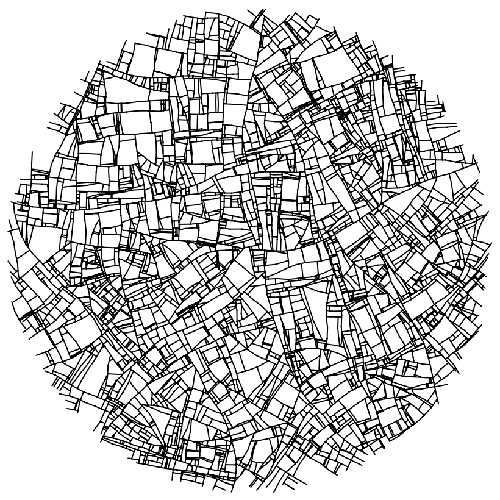

Trying to implement the gneerative algorithm described at inconvergent.net/generative/fractures/.

The algorithm works by extending a line until it hits the border or another line. When a fracture terminates, a new one spawns at right angles to one somewhere else.